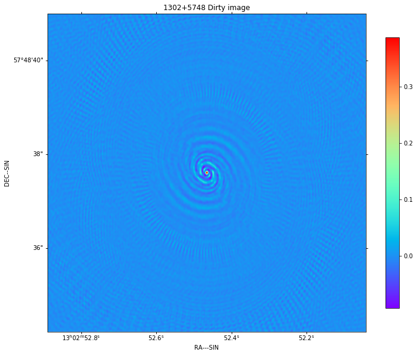
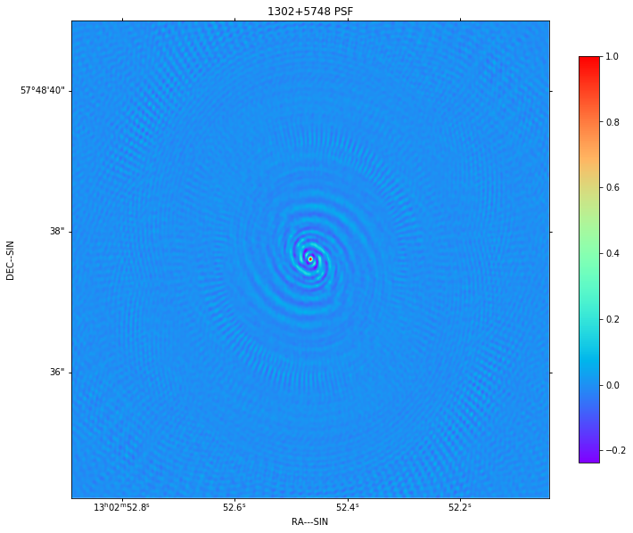
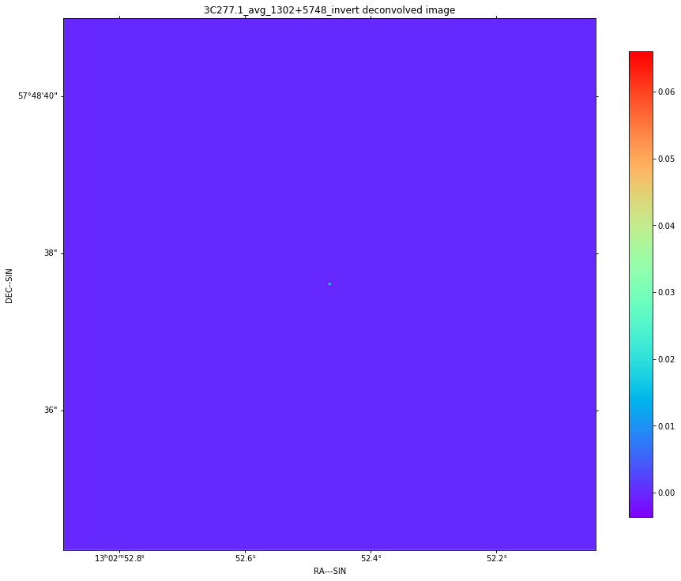
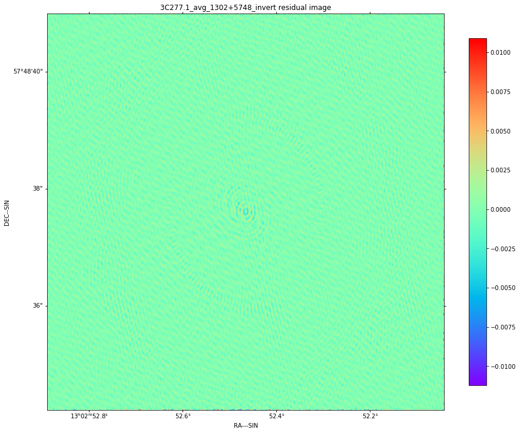
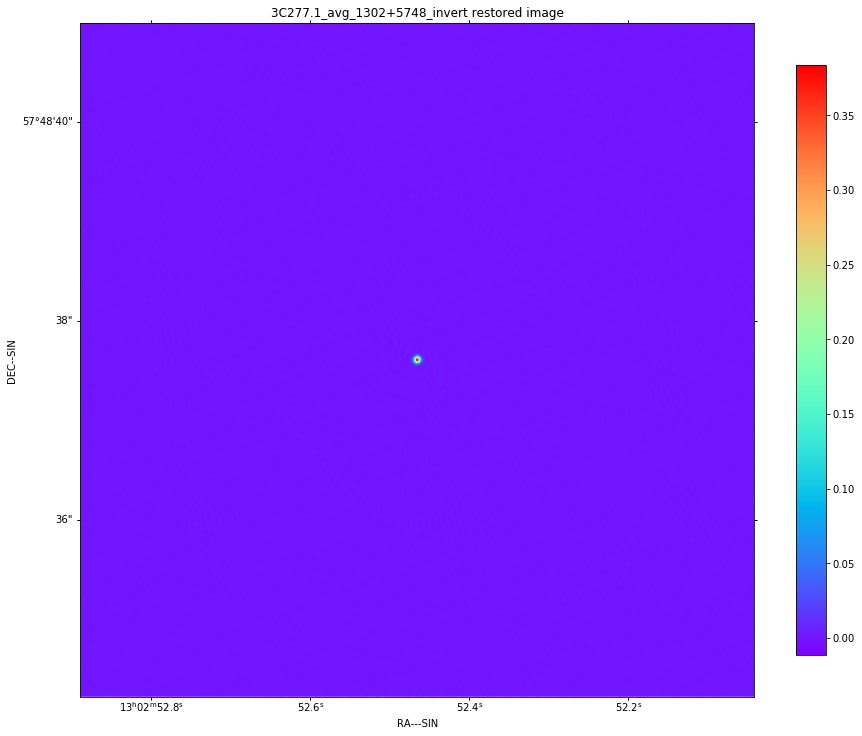
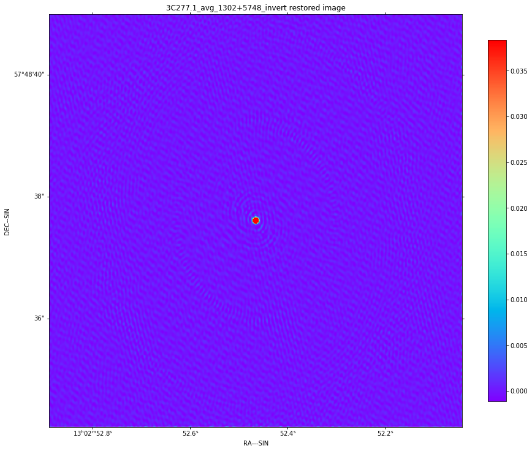

Notebook for imaging eMERLIN calibrated data
--------------------------------------------

This illustrates how RASCIL may be used to image eMERLIN data. The
example data is from:

http://www.e-merlin.ac.uk/distribute/support/tutorials/3C277.1_20150505.tar

For a summary of the images produced by the eMERLIN CASA pipeline see:

http://www.e-merlin.ac.uk/distribute/support/tutorials/3C277.1_20150505/weblog/index.html

To run this notebook, you will need:

-  RASCIL from https://github.com/SKA-ScienceDataProcessor/rascil
-  The data from above
-  nifty-gridder from https://gitlab.mpcdf.mpg.de/ift/nifty_gridder

.. code:: ipython3

    %matplotlib inline
    
    import logging
    import matplotlib.pyplot as plt
    import os
    plt.rcParams['figure.figsize'] = [12, 12]
    plt.rcParams['image.cmap'] = 'rainbow'
    
    import numpy
    
    
    from rascil.processing_components import show_image, qa_image, export_image_to_fits, qa_gaintable, \
        create_blockvisibility_from_ms, list_ms, integrate_visibility_by_channel, \
        concatenate_blockvisibility_frequency,   convert_blockvisibility_to_stokesI, \
        convert_blockvisibility_to_visibility, convert_visibility_to_blockvisibility, weight_visibility,\
        create_image_from_visibility, advise_wide_field, create_calibration_controls, gaintable_plot, \
        deconvolve_cube, restore_cube
    
    
    
    from rascil.processing_components.imaging.ng import invert_ng
    
    
    cwd = os.getcwd()
    
    log = logging.getLogger()
    log.setLevel(logging.INFO)
    log.addHandler(logging.FileHandler('%s/eMERLIN_imaging.log' % cwd))
    
    logging.basicConfig(filename='%s/eMERLIN_imaging.log' % cwd,
                        filemode='w',
                        format='%(date)s %(asctime)s.%(msecs)d %(name)s %(levelname)s %(message)s',
                        datefmt='%H:%M:%S',
                        level=logging.DEBUG)
    log.info("Logging to %s/eMERLIN_imaging.log" % cwd)
    

List the contents of the MeasurementSet: sources and data descriptors
^^^^^^^^^^^^^^^^^^^^^^^^^^^^^^^^^^^^^^^^^^^^^^^^^^^^^^^^^^^^^^^^^^^^^

.. code:: ipython3

    print(list_ms('../../data/3C277.1_avg.ms'))

.. parsed-literal::

    (['1302+5748', '0319+415', '1407+284', '1252+5634', '1331+305'], [0, 1, 2, 3])

Load just 3C277.1 (1252+5634) and ‘1302+5748’
^^^^^^^^^^^^^^^^^^^^^^^^^^^^^^^^^^^^^^^^^^^^^

.. code:: ipython3

    selected_sources = ['1302+5748']
    bvis_list = create_blockvisibility_from_ms('../../data/3C277.1_avg.ms', datacolumn='CORRECTED_DATA',
                                               selected_sources=selected_sources)
    sources = numpy.unique([bv.source for bv in bvis_list])
    print(sources)
    print(numpy.max(bvis_list[0].flagged_vis))

.. parsed-literal::

    ['1302+5748']
    (3.6251304149627686-1.2135764360427856j)

.. code:: ipython3

    flag = False
    if flag:
        
        import aoflagger as aof
        
        bvis=bvis_list[0]
        ntimes, nant, _, nch, npol = bvis.vis.shape
    
        aoflagger = aof.AOFlagger()
        # Shape of returned buffer is actually nch, ntimes
        data = aoflagger.make_image_set(ntimes, nch, npol*2)
    
        print("Number of times: " + str(data.width()))
        print("Number of antennas:" +str(nant))
        print("Number of channels: " + str(data.height()))
        print("Number of polarisations: " + str(npol))
        eMERLIN_strategy = aoflagger.load_strategy('eMERLIN_strategy.rfis')
    
        for a2 in range(0, nant-1):
            for a1 in range(a2+1,nant):
                for pol in range(npol):
                    data.set_image_buffer(2*pol,   numpy.real(bvis.vis[:,a1,a2,:,pol]).T)
                    data.set_image_buffer(2*pol+1, numpy.imag(bvis.vis[:,a1,a2,:,pol]).T)
    
    
                flags = aoflagger.run(eMERLIN_strategy, data)
                flagvalues = flags.get_buffer() * 1
                bvis.data['flags'][:,a1,a2,:,:] = flagvalues.T[...,numpy.newaxis]
                flagcount = sum(sum(flagvalues))
                print(str(a1) + " " + str(a2) + ": percentage flags on zero data: " 
                      + str(flagcount * 100.0 / (nch*ntimes)) + "%")

Average across all each BlockVisibility over all 128 channels, and then concatenate into single BlockVisibilitys, one per source
^^^^^^^^^^^^^^^^^^^^^^^^^^^^^^^^^^^^^^^^^^^^^^^^^^^^^^^^^^^^^^^^^^^^^^^^^^^^^^^^^^^^^^^^^^^^^^^^^^^^^^^^^^^^^^^^^^^^^^^^^^^^^^^^

.. code:: ipython3

    avis_list = [integrate_visibility_by_channel(bvis) for bvis in bvis_list]
    print(numpy.max(avis_list[0].flagged_vis))
    blockvis = [concatenate_blockvisibility_frequency(avis_list[isource * 4:(isource * 4 + 4)])
                for isource, source in enumerate(sources)]
    print(numpy.max(blockvis[0].flagged_vis))

.. parsed-literal::

    (0.5486884866032965-0.025304708926176478j)
    (0.5617308082532079-0.006965692214194751j)

Run one of:
^^^^^^^^^^^

-  Invert + deconvolve + restore (mode=‘invert’)
-  Continuum Imaging Pipeline (mode=‘cip’)
-  ICAL pipeline (mode=‘ical’)

.. code:: ipython3

    plt.rcParams['figure.figsize'] = [12, 12]
    plt.rcParams['image.cmap'] = 'rainbow'
    
    from rascil.workflows import continuum_imaging_list_serial_workflow, \
        ical_list_serial_workflow
    
    advice = advise_wide_field(avis_list[0], verbose=False)
    for svis in blockvis:
        frequency = [numpy.mean(svis.frequency)]
        channel_bandwidth = [numpy.sum(svis.channel_bandwidth)]
        ivis = convert_blockvisibility_to_stokesI(svis)
        print(numpy.max(ivis.flagged_weight))
        model = create_image_from_visibility(ivis, npixel=1024, 
                                             cellsize=advice['cellsize']/3.0, nchan=1,
                                             frequency=frequency, 
                                             channel_bandwidth=channel_bandwidth)
        cvis = convert_blockvisibility_to_visibility(ivis)
        print(numpy.max(cvis.flagged_weight))
        cvis = weight_visibility(cvis, model)
        print(numpy.max(cvis.flagged_weight))
        ivis = convert_visibility_to_blockvisibility(cvis)
        print(numpy.max(ivis.flagged_weight))
        
        for mode in ["invert"]:
            
            print("\n")
            print("Processing {source:s} via {mode:s} pipeline".format(source=svis.source, 
                                                                       mode=mode))
            print("\n")
    
            filename_root = "3C277.1_avg_{source:s}_{mode:s}".format(source=svis.source, mode=mode)
    
            if mode == "ical":
                controls = create_calibration_controls()
                controls['T']['first_selfcal'] = 1
                controls['T']['phase_only'] = True
                controls['T']['timeslice'] = 3.0
                controls['G']['first_selfcal'] = 10
                controls['G']['phase_only'] = False
                controls['G']['timeslice'] = 3600.0
    
    
                deconvolved, residual, restored, gt_list = \
                    ical_list_serial_workflow([ivis], [model], context='ng', nmajor=15,
                                              niter=1000, algorithm='msclean',
                                              scales=[0, 3, 10], gain=0.1,
                                              fractional_threshold=0.5,
                                              threshold=0.0015,
                                              window_shape='quarter',
                                              do_wstacking=False,
                                              global_solution=False,
                                              calibration_context='TG',
                                              do_selfcal=True,
                                              controls=controls)
                deconvolved = deconvolved[0]
                residual = residual[0][0]
                restored = restored[0]
                gt = gt_list[0]['T']
                print(qa_gaintable(gt))
                fig, ax = plt.subplots(1,1)
                gaintable_plot(gt, ax, value='phase')
                plt.show(block=False)
    
                gt = gt_list[0]['G']
                print(qa_gaintable(gt))
                fig, ax = plt.subplots(1,1)
                gaintable_plot(gt, ax, value='amp')
                plt.show(block=False)
    
    
            elif mode == "cip":
                deconvolved, residual, restored = \
                    continuum_imaging_list_serial_workflow([ivis], [model], context='ng',
                                                           nmajor=10, niter=1000, 
                                                           algorithm='msclean',
                                                           scales=[0, 3, 10], gain=0.1,
                                                           fractional_threshold=0.5,
                                                           threshold=0.0015,
                                                           window_shape='quarter',
                                                           do_wstacking=False)
    
                deconvolved = deconvolved[0]
                residual = residual[0][0]
                restored = restored[0]
    
            else:
                mode = "invert"
                print(numpy.max(ivis.flagged_vis))
                dirty, sumwt = invert_ng(ivis, model, do_wstacking=False)
                print(sumwt)
                plt.clf()
                show_image(dirty, title=svis.source + " Dirty image", cm="rainbow")
                plt.show(block=False)
    
                psf, sumwt = invert_ng(ivis, model, do_wstacking=False, dopsf=True)
                plt.clf()
                show_image(psf, title=svis.source + " PSF", cm="rainbow")
                plt.show(block=False)
    
                deconvolved, residual = deconvolve_cube(dirty, psf, niter=1000, algorithm='msclean',
                                                        fractional_threshold=1e-3,
                                                        scales=[0, 3, 10], gain=0.1, 
                                                        threshold=0.003,
                                                        window_shape='quarter')
                restored = restore_cube(deconvolved, psf, residual)
    
            print(qa_image(deconvolved, context='Deconvolved image'))
            plt.clf()
            show_image(deconvolved, title=filename_root + " deconvolved image", cm="rainbow")
            plt.tight_layout()
            plt.show(block=False)
            filename = "{root:s}_deconvolved.fits".format(root=filename_root)
            export_image_to_fits(deconvolved, filename)
    
    
            print(qa_image(residual, context='Residual image'))
            plt.clf()
            show_image(residual, title=filename_root + " residual image", cm="rainbow")
            plt.tight_layout()
            plt.show(block=False)
            filename = "{root:s}_residual.fits".format(root=filename_root)
            export_image_to_fits(residual, filename)
    
    
            print(qa_image(restored, context='Restored image'))
            plt.clf()
            show_image(restored, title=filename_root + " restored image", cm="rainbow")
            plt.tight_layout()
            plt.show(block=False)        
    
            plt.clf()
            show_image(restored, title=filename_root + " restored image", vscale=0.1, cm="rainbow")
            plt.tight_layout()
            plt.show(block=False)        
    
            filename = "{root:s}_restored.fits".format(root=filename_root)
            export_image_to_fits(restored, filename)
        

.. parsed-literal::

    32171.104385375977
    32171.104385375977
    32171.104385375977
    32171.104385375977
    
    
    Processing 1302+5748 via invert pipeline
    
    
    (0.5328565679475172-0.01925461547793666j)
    [[3101.]]

.. parsed-literal::

    <Figure size 864x864 with 0 Axes>

.. parsed-literal::

    <Figure size 864x864 with 0 Axes>

.. parsed-literal::

    WARNING: The fit may be unsuccessful; check fit_info['message'] for more information. [astropy.modeling.fitting]

.. parsed-literal::

    Quality assessment:
    	Origin: qa_image
    	Context: Deconvolved image
    	Data:
    		shape: '(1, 1, 1024, 1024)'
    		max: '0.0660288777182319'
    		min: '-0.0036082975645527573'
    		maxabs: '0.0660288777182319'
    		rms: '9.891240519684737e-05'
    		sum: '0.38794770853309335'
    		medianabs: '0.0'
    		medianabsdevmedian: '0.0'
    		median: '0.0'
    

.. parsed-literal::

    <Figure size 864x864 with 0 Axes>

.. parsed-literal::

    Quality assessment:
    	Origin: qa_image
    	Context: Residual image
    	Data:
    		shape: '(1, 1, 1024, 1024)'
    		max: '0.010901296724006032'
    		min: '-0.01121451535388803'
    		maxabs: '0.01121451535388803'
    		rms: '0.0006071874058498673'
    		sum: '-0.2536146346994712'
    		medianabs: '0.0003852406189283605'
    		medianabsdevmedian: '0.0003853356548594309'
    		median: '1.4435665603078142e-06'
    

.. parsed-literal::

    <Figure size 864x864 with 0 Axes>

.. parsed-literal::

    Quality assessment:
    	Origin: qa_image
    	Context: Restored image
    	Data:
    		shape: '(1, 1, 1024, 1024)'
    		max: '0.3837102173522667'
    		min: '-0.01121451535388803'
    		maxabs: '0.3837102173522667'
    		rms: '0.0024169261768822664'
    		sum: '29.130297053075758'
    		medianabs: '0.0003852370705837218'
    		medianabsdevmedian: '0.0003853153133583213'
    		median: '1.7521509637877972e-06'
    

.. parsed-literal::

    <Figure size 864x864 with 0 Axes>

.. parsed-literal::

    <Figure size 864x864 with 0 Axes>

